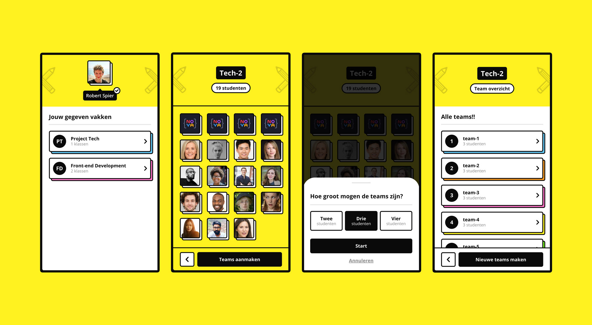

# :sparkles: CMD Online :sparkles:
   

CMD Online, previously known as Project Team Creator, is a browser based matching application, build with HTML/CSS/JS and Node.js. Originally CMD Online was build to help teachers of CMD create well-balanced project teams based on skills of students. As of now, CMD Online strives to become more of a community for students and teachers of CMD.

As stated before CMD Online offers a matching feature that lets teachers generate teams for their classes based on the CMD skills of their students. Teachers no longer have to spend time and energy on creating teams and worrying whether or not skill levels of students will match. In addition, students no longer have to worry about their upcoming project team, knowing their team will be fair and balanced!



## :computer: Features

CMD Online has recently received an upgrade, it now also offers the following **new** features: 

| Features :nail_care:        | Developer(s) in charge :neckbeard: | Status :rocket:    |
|-----------------------------|------------------------------------|--------------------|
| **(NEW)** Create account    | Aidan Omwando                      | :white_check_mark: |
| **(NEW)** Login             | Aidan Omwando                      | :white_check_mark: |
| **(NEW)** Profile setup     | Tejo van der Burg & Maijla Ikiz    | :white_check_mark: |
| **(NEW)** CMD Skills setup  | Juliette Groot & Maijla Ikiz       | :white_check_mark: |
| Team generator              | Maijla Ikiz                        | :white_check_mark: |
| **(NEW)** CMS               | Maijla Ikiz                        | :white_check_mark: |
| Mongoose                    | Maijla Ikiz                        | :white_check_mark: |
| **(NEW)** Error handling    | Juliette Groot                     | :white_check_mark: |
| **(NEW)** Node Mailer       | Tejo van der Burg                  | :white_check_mark: |
| **(NEW)** Asset compression | Aidan Omwando                      | :white_check_mark: |

## :zap: Quickstart
 If you want to start working with on PTC, and you have cloned this repo to your desktop, go to its root directory and run `npm install` to install its dependencies.

Now that we are all on the same page, it is time to connect a database to your project. In the `config` folder you will find a file called `db.js`. This is where you establish the connection with our dev database. In order to establish the connection, you need a `.env` file in the root of your project. Your `.env` file should then (at least for the database connection) contain the following information:

~~~
DB_USER= your database user
DB_NAME= cmd-online-db
DB_PASS= your database password
SecretSESSION= your session password
usermail=your gmail
passmail=your gmail password
~~~

The password for `SecretSESSION` can be anything you want. As of now, we do not have a base JSON file with dummy data you could import into your database, but we're working on it :wink:. That's why we have a dev database. To gain access to this database, please get in touch with the creator.

---
Don't forget to chage your gmail acount to make sure it has asses to 
[gmail less secure apps](https://stackoverflow.com/questions/19877246/nodemailer-with-gmail-and-nodejs).

---

Now that you're ready to ***really*** get started, you can run the application with or without [nodemon](https://www.google.com/settings/security/lesssecureapps). 

Running the application 'normally'
~~~
npm start
~~~

Running the application with nodemon
~~~
npm run start:dev
~~~

Both these prompts will give you access to CMD Online via `localhost:3000/`. And That's it! Have any trouble? Feel free to let us know by submitting an issue. (no e-mail yet :stuck_out_tongue:)

## :eyes: Usage (code examples)
Listed below are some of the common examples with our very own CRUD operations.

### createDoc(schema, object)
Running this operation will save a new `object` (or also known as document in MongoDb) inside the specified collection based on it's `schema` and then return said object.

```javascript
const CRUD = require('./controller/crud-operations');
CRUD.createDoc(schemas.Course, { title: "Project Tech" });
```

### createMultipleDocs(schema, objects)
Running this operation will save multiple `objects` inside the specified collection based on it's `schema`

```javascript
const CRUD = require('./controller/crud-operations');
CRUD.createMultipleDocs(schemas.Course, [{title: "Front-end Development"}, {title: "Project Tech"}]);
```

### findDocByQuery(schema, property, equalTo)
Running this operation will find and then return a document based on which `property` it should be equal to.

```javascript
const CRUD = require('./controller/crud-operations');
CRUD.findDocByQuery(schema.Course, "title", "Project Tech");
```

### addIdReferenceToDoc(schemaToFind, docIds, referenceSchemas, referenceIds)
This operation is mostly used to update other documents with reference ids. So, running this operation will allow you to find a specific document with `docIds` inside a collection or schema with `schemaToFind`. You also have to specify which attribute of this specific document you want to insert data into with `referenceSchemas`. Lastly, you specify which `referenceIds` you are inserting into the `referenceSchemas`.

```javascript
const CRUD = require('./controller/crud-operations');
CRUD.findDocByQuery(schemas.User, "username", "stinky").then((user) => {
  CRUD.findDocByQuery(schemas.Class, "name", "Tech-2").then((course) => {
    CRUD.addIdReferenceToDoc(schemas.Class, course._id, "students", user._id);
  });
});
```

### createAcronym(string)
Running this function will create an acronym with the first two letters of the provied `string`

```javascript
const acronymGen = require('./public/js/acronym-generator');
let acronym = acronymGen.createAcronym("Front-end Development");

RESULT:
FD
```

## :package: Packages
Our team creator application makes use of the following packages:
- [nodemon](https://www.npmjs.com/package/nodemon)
- [body-parser](https://www.npmjs.com/package/body-parser)
- [dotenv](https://www.npmjs.com/package/dotenv)
- [express](https://www.npmjs.com/package/express)
- [express-handlebars](https://www.npmjs.com/package/express-handlebars)
- [mongodb](https://www.npmjs.com/package/mongodb)
- [mongoose](https://www.npmjs.com/package/mongoose)
- [param-case](https://www.npmjs.com/package/param-case)

## :memo: Documentation

Learn more about PTC and dive deeper into this project by reading the process documentation in our [wiki](https://github.com/noyamirai/projectteamcreator/wiki).

## :warning: License

This project is licensed under the terms of the MIT license.

[](https://github.com/noyamirai/projectteamcreator/blob/main/LICENSE)

